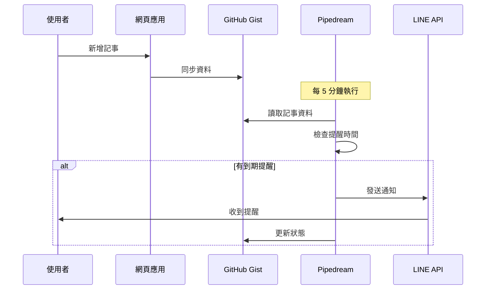

# LINE 提醒記事本 - Pipedream 雲端版

## 🚀 快速開始

這是 LINE 提醒記事本的雲端版本，使用 Pipedream 提供 24/7 定時通知服務。

### 📦 檔案說明

```
📁 專案檔案
├── 📄 LineNotify_cloud.html          ← 網頁應用（雲端版）
├── 📄 LineNotify_status_laste.html   ← 原始版本（需保持瀏覽器開啟）
├── 📄 pipedream-workflow.js          ← Pipedream workflow 程式碼
├── 📄 SETUP.md                       ← 詳細設定指南
└── 📄 README.md                      ← 本檔案
```

### ✨ 新版本特色

**雲端版 (LineNotify_cloud.html)**

- ✅ 不需要保持瀏覽器開啟
- ✅ 24/7 自動檢查和發送通知
- ✅ 跨裝置同步資料
- ✅ 資料儲存在 GitHub Gist
- ✅ 完全免費方案

**原始版 (LineNotify_status_laste.html)**

- ⚠️ 需要保持瀏覽器分頁開啟
- ⚠️ 需要防止螢幕休眠
- ✅ 資料儲存在本地
- ✅ 不需要額外設定

### 🎯 使用哪個版本？

| 需求               | 推薦版本  |
| ------------------ | --------- |
| 想要 24/7 自動運行 | 雲端版 ⭐ |
| 想要跨裝置同步     | 雲端版 ⭐ |
| 不想做額外設定     | 原始版    |
| 只在單一裝置使用   | 原始版    |
| 可以保持電腦開機   | 原始版    |

## 📖 設定步驟（雲端版）

### 簡要版本（5 步驟）

1. **創建 GitHub Token**

   - 前往 [GitHub Token 設定](https://github.com/settings/tokens/new?scopes=gist&description=LINE%20Reminder%20App)
   - 勾選 `gist` 權限
   - 複製 Token

2. **註冊 Pipedream**

   - 前往 [Pipedream](https://pipedream.com)
   - 註冊免費帳號

3. **創建 Workflow**

   - 新增 Workflow
   - 觸發器：Cron Schedule `*/5 * * * *`
   - 貼上 `pipedream-workflow.js` 程式碼
   - 設定環境變數：`GITHUB_TOKEN`（先不填 `GIST_ID`）

4. **設定網頁**

   - 開啟 `LineNotify_cloud.html`
   - 填入 LINE 設定和 GitHub Token
   - 儲存後會自動創建 Gist

5. **完成設定**
   - 複製 Gist ID 回填到 Pipedream
   - 重新部署 Workflow
   - 完成！

📚 **詳細步驟請參閱：[SETUP.md](SETUP.md)**

## 🎬 運作流程



## ⚙️ 技術架構

### 前端 (LineNotify_cloud.html)

- HTML5 + Vanilla JavaScript
- Tailwind CSS 樣式
- localStorage 本地快取
- GitHub Gist API 整合

### 後端 (Pipedream)

- Node.js 執行環境
- Cron 定時觸發
- GitHub API
- LINE Messaging API

### 資料儲存

- GitHub Gist（雲端 JSON 儲存）
- localStorage（本地備份）

## 📊 免費方案限制

| 服務        | 免費額度     | 足夠使用？         |
| ----------- | ------------ | ------------------ |
| GitHub Gist | 無限制       | ✅ 是              |
| Pipedream   | 10,000 次/月 | ✅ 是（每 5 分鐘） |
| LINE API    | 按訊息計費   | ✅ 個人使用足夠    |

**每 5 分鐘執行一次**：

- 每小時：12 次
- 每天：288 次
- 每月：8,640 次
- **剩餘額度**：1,360 次（可手動觸發或測試）

## 🔧 進階功能

### 重複提醒

- 每天重複
- 每週重複（可選星期）
- 每月重複（可選日期）
- 設定結束日期

### 完成狀態

- 已發送後可標記完成/未完成
- 視覺化圖示提示

### 資料管理

- 匯出/匯入 JSON 備份
- 跨裝置同步
- 自動雲端備份

## 🐛 疑難排解

### 沒有收到通知？

1. 檢查 Pipedream Event History 日誌
2. 確認 GIST_ID 已設定
3. 驗證 LINE Token 正確性
4. 確認提醒時間已過 5 分鐘以上

### 同步失敗？

1. 檢查 GitHub Token 是否有效
2. 確認網路連線
3. 查看瀏覽器 Console 錯誤

### 詳細解答請見：[SETUP.md - 常見問題](SETUP.md#常見問題)

## 📝 版本資訊

- **原始版本 (v20)**: 單機版，需保持開啟
- **雲端版 (v21)**: Pipedream 整合，24/7 運行

## 🙏 致謝

- [Tailwind CSS](https://tailwindcss.com) - 樣式框架
- [Lucide Icons](https://lucide.dev) - 圖示
- [Pipedream](https://pipedream.com) - 自動化平台
- [GitHub Gist](https://gist.github.com) - 資料儲存

---

**Author**: Joy  
**Created**: 2025-11-30
