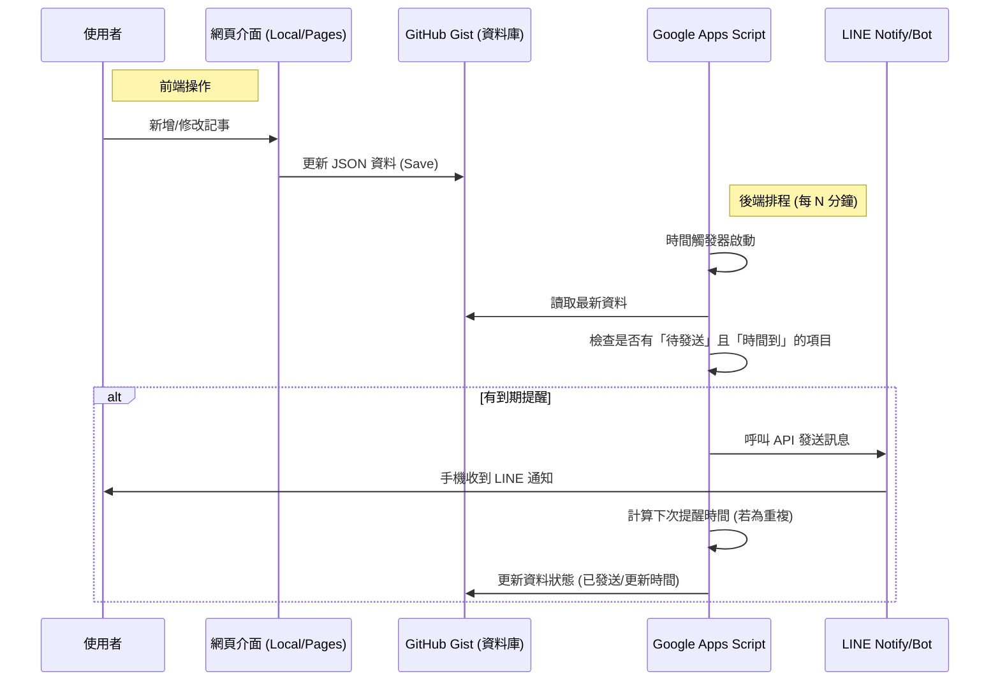

# LINE 提醒記事本 - Google Apps Script (GAS) 雲端版

## 🚀 專案簡介

這是 LINE 提醒記事本的 Google Apps Script (GAS) 雲端版本。
透過 Google 免費提供的伺服器資源，實現 **24/7 全天候自動監控** 與 **LINE 通知發送**，無需開啟電腦或瀏覽器。

## 📦 檔案說明

```text
📁 專案檔案
├── 📄 LineNotify_cloud.html          ← 前端網頁（操作介面，可放 GitHub Pages）
├── 📄 gas-script.js                  ← 後端程式碼（需貼入 Google Apps Script）
├── 📄 SETUP_GAS.md                   ← 詳細設定指南
└── 📄 README.md                      ← 本檔案
```

## ✨ 版本特色

### ☁️ 雲端版 (Google Apps Script)

- ✅ **完全自動化**：利用 Google 伺服器每分鐘或每 5 分鐘檢查一次。
- ✅ **免掛機**：設定完成後，電腦關機、手機關閉螢幕均可正常運作。
- ✅ **跨裝置同步**：資料儲存於 GitHub Gist，手機與電腦看到的資料一致。
- ✅ **高穩定性**：Google 基礎建設提供穩定的定時觸發服務。

## 📖 設定步驟（GAS 版）

### 流程概覽

1. **準備雲端儲存 (GitHub Gist)**
   - 申請 GitHub Personal Access Token (需勾選 gist 權限)。
   - 建立一個 Gist 用於儲存資料。

2. **建立後端排程 (Google Apps Script)**
   - 前往 script.google.com 建立新專案。
   - 將 `gas-script.js` 的內容複製貼上。
   - 設定 **專案屬性 (Script Properties)**：填入 `GITHUB_TOKEN`、`GIST_ID`、`LINE_TOKEN`。
   - 設定 **觸發條件 (Triggers)**：設定「時間驅動」每 5 分鐘或 10 分鐘執行一次 `main` 函式。

3. **設定前端網頁**
   - 開啟 `LineNotify_cloud.html`。
   - 在設定中填入 GitHub Token 與 Gist ID。
   - 開始新增/管理您的提醒事項。

📚 **詳細圖文步驟請參閱：SETUP_GAS.md**

## 🎬 運作流程



## ⚙️ 技術架構

### 前端 (Client-side)

- **介面**：HTML5 + Tailwind CSS (單一檔案)。
- **邏輯**：JavaScript (ES6+)。
- **功能**：負責資料的 CRUD (增刪改查) 與 Gist 同步。

### 後端 (Server-side)

- **平台**：Google Apps Script (基於 V8 引擎)。
- **核心**：`UrlFetchApp` (呼叫 GitHub 與 LINE API)。
- **排程**：GAS Time-driven Triggers (定時觸發器)。
- **安全**：使用 `PropertiesService` 儲存敏感 Token，不寫死在程式碼中。

### 資料庫

- **GitHub Gist**：作為輕量級 JSON 資料庫，讓前端與後端共享數據。

## 📊 Google Apps Script 免費配額

GAS 對個人帳戶非常大方，對於個人提醒應用來說綽綽有餘：

| 項目 | 限制 | 足夠使用？ |
|------|------|------------|
| 觸發器執行時間 | 90 分鐘 / 天 | ✅ 是 (每次執行僅需約 1-2 秒) |
| URL Fetch (API 呼叫) | 20,000 次 / 天 | ✅ 是 (遠大於每 5 分鐘一次的需求) |
| 最大執行時間 | 6 分鐘 / 次 | ✅ 是 |

> **註**：建議設定每 5 分鐘或 10 分鐘檢查一次即可，過於頻繁 (如每分鐘) 雖然可行但較耗資源。

## 🔧 進階功能

### 🔄 智慧重複提醒

- 支援 **每天**、**每週** (可選星期)、**每月** (可選日期)。
- GAS 後端發送通知後，會自動計算並寫入下一次的提醒時間，實現真正的循環。

### 📲 完成狀態標記

- 支援標記任務為「完成」或「未完成」。
- 狀態同步儲存於雲端。

### 📂 資料備份

- 前端網頁支援匯出/匯入 JSON 備份檔，確保資料安全。

## 🐛 疑難排解

### 沒有收到通知？

1. **檢查 GAS 執行紀錄**：
   - 進入 GAS 編輯器左側的「執行項目 (Executions)」。
   - 查看是否有 Failed 或 Error 的紀錄。

2. **檢查屬性設定**：
   - 確認 `GIST_ID` 和 `GITHUB_TOKEN` 在 GAS 的「專案設定」中是否正確。

3. **檢查 LINE Token**：
   - 確認 LINE Token 是否過期或被封鎖。

### 同步失敗？

- 確認 GitHub Token 是否有勾選 `gist` 權限。
- 確認 Gist ID 是否正確對應到您存放資料的那個 Gist。

---

**Author**: Joy  
**Updated**: 2025-12-15