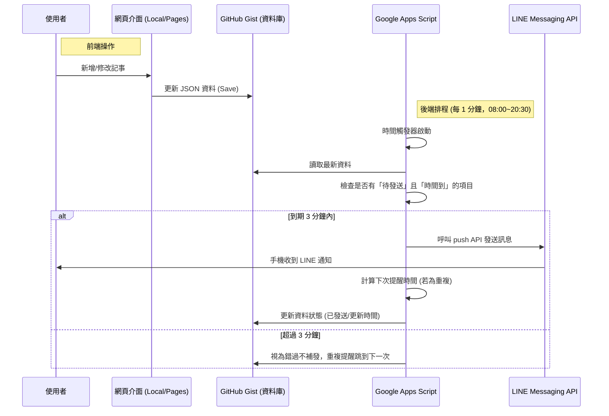

# LINE 提醒記事本 - Google Apps Script (GAS) 雲端版

## 🚀 專案簡介

這是 LINE 提醒記事本的 Google Apps Script (GAS) 雲端版本。
透過 Google 免費提供的伺服器資源，實現 **全天候自動監控** 與 **LINE 通知發送**，無需開啟電腦或瀏覽器。

通知透過 **LINE Messaging API**（LINE 官方帳號 Bot 的 push message）發送。

## 📦 檔案說明

```text
📁 專案檔案
├── 📄 index.html          ← 前端網頁（操作介面，可放 GitHub Pages）
├── 📄 styles.css          ← 自訂樣式
├── 📄 notes-core.js       ← 無 DOM 依賴的純邏輯（時間解析、狀態判定、狀態篩選、分類顏色、記事 id）
├── 📄 script.js           ← 記事列表、表單、搜尋篩選、備份、雲端同步
├── 📄 calendar.js         ← 行事曆的計算與渲染
├── 📄 test-calendar.html  ← 純函式測試頁，用瀏覽器直接開啟即可執行
├── 📄 gas-script.js       ← 後端程式碼（需貼入 Google Apps Script）
├── 📄 favicon.png         ← 網頁圖示
├── 📄 SETUP_GAS.md        ← 詳細設定指南
└── 📄 README.md           ← 本檔案
```

## ✨ 版本特色

### ☁️ 雲端版 (Google Apps Script)

- ✅ **完全自動化**：由 Google 伺服器每分鐘檢查一次是否有到期提醒。
- ✅ **免掛機**：設定完成後，電腦關機、手機關閉螢幕均可正常運作。
- ✅ **跨裝置同步**：資料儲存於 GitHub Gist，手機與電腦看到的資料一致。
- ✅ **高穩定性**：Google 基礎建設提供穩定的定時觸發服務。

### 📝 記事管理

- **分類**：重要、工作、私事、已完成，每個分類有自己的顏色。
- **搜尋**：可依記事內容或分類關鍵字搜尋。
- **篩選**：可依分類與發送狀態（待發送 / 已發送 / 過期未發）篩選，列表與行事曆共用同一組篩選條件。
- **可收合表單**：新增記事區塊可以收合，收合狀態會記在瀏覽器中。
- **回到頂部按鈕**：列表很長時可一鍵回到頂部。

### 📅 行事曆檢視

記事列表上方可切換「列表 / 行事曆」。行事曆以週視圖呈現，橫軸為星期一到星期日（可切換為工作天），
縱軸為 24 小時制時間軸，預設顯示 06:00 至 24:00，當週若有更早的記事會自動往上擴展。

- 重複記事會依重複規則展開為當週所有符合的時間點
- 方塊底色代表發送狀態，左側色條代表分類，右下角圖示代表重複
- 時間重疊的記事在該日欄內左右平分寬度
- 點擊方塊可開啟詳情浮層看完整內容，並可直接編輯或刪除
- 螢幕寬度小於 768px 時自動切換為單日視圖

## 📖 設定步驟（GAS 版）

### 流程概覽

1. **準備雲端儲存 (GitHub Gist)**
   - 申請 GitHub Personal Access Token（需勾選 `gist` 權限）。
   - 在前端網頁填入 Token 後按同步，Gist ID 留空會自動建立新的 Gist。

2. **準備 LINE Messaging API**
   - 建立 LINE 官方帳號與 Messaging API Channel。
   - 取得 **Channel Access Token** 與自己的 **User ID**（以 `U` 開頭）。

3. **建立後端排程 (Google Apps Script)**
   - 前往 script.google.com 建立新專案。
   - 將 `gas-script.js` 的內容複製貼上。
   - 設定 **指令碼屬性 (Script Properties)**：

     | 屬性                        | 說明                                              |
     | --------------------------- | ------------------------------------------------- |
     | `GITHUB_TOKEN`              | GitHub Personal Access Token                      |
     | `GIST_ID`                   | Gist ID                                           |
     | `GIST_FILENAME`             | Gist 內的檔名，前端固定使用 `line-reminder-data.json` |
     | `LINE_CHANNEL_ACCESS_TOKEN` | LINE Channel Access Token                         |
     | `LINE_USER_ID`              | 接收通知的 LINE User ID                           |

   - 設定 **觸發條件 (Triggers)**：「時間驅動」→「分鐘計時器」→ **每 1 分鐘** 執行 `main` 函式。

4. **設定前端網頁**
   - 開啟 `index.html`（或發佈到 GitHub Pages）。
   - 在設定中填入 GitHub Token 與 Gist ID。
   - 開始新增/管理您的提醒事項。

📚 **詳細圖文步驟請參閱：[SETUP_GAS.md](SETUP_GAS.md)**

## 🎬 運作流程


```mermaid
sequenceDiagram
    participant User as 使用者
    participant Web as 網頁介面 (Local/Pages)
    participant Gist as GitHub Gist (資料庫)
    participant GAS as Google Apps Script
    participant LINE as LINE Messaging API

    Note left of Web: 前端操作
    User->>Web: 新增/修改記事
    Web->>Gist: 更新 JSON 資料 (Save)

    Note right of GAS: 後端排程 (每 1 分鐘，08:00~20:30)
    GAS->>GAS: 時間觸發器啟動
    GAS->>Gist: 讀取最新資料
    GAS->>GAS: 檢查是否有「待發送」且「時間到」的項目

    alt 到期 3 分鐘內
        GAS->>LINE: 呼叫 push API 發送訊息
        LINE->>User: 手機收到 LINE 通知
        GAS->>GAS: 計算下次提醒時間 (若為重複)
        GAS->>Gist: 更新資料狀態 (已發送/更新時間)
    else 超過 3 分鐘
        GAS->>Gist: 視為錯過不補發，重複提醒跳到下一次
    end
```

## ⚙️ 技術架構

### 前端 (Client-side)

- **介面**：HTML5 + Tailwind CSS (CDN) + Lucide 圖示。
- **邏輯**：原生 JavaScript (ES6+)，依功能拆成 `notes-core.js`、`script.js`、`calendar.js`。
- **功能**：負責資料的 CRUD (增刪改查)、搜尋篩選、行事曆檢視與 Gist 同步。
- **本機暫存**：資料與設定也會存在瀏覽器 `localStorage`。

### 後端 (Server-side)

- **平台**：Google Apps Script (基於 V8 引擎)。
- **核心**：`UrlFetchApp` (呼叫 GitHub 與 LINE API)。
- **排程**：GAS Time-driven Triggers (定時觸發器)。
- **安全**：使用 `PropertiesService` 儲存敏感 Token，不寫死在程式碼中。

### 資料庫

- **GitHub Gist**：作為輕量級 JSON 資料庫，讓前端與後端共享數據。

## ⏰ 發送規則

- **執行時段**：只在台北時間 **08:00 ~ 20:30** 之間檢查，其他時間直接跳過，減少 API 呼叫。
- **允許延遲 3 分鐘**：超過預定時間 3 分鐘仍未送出就視為錯過，**不補發**。因此觸發器請設為 **每 1 分鐘**，設太久會漏發。
- **不重複發送**：用 `lastPlanned` 記住處理過的時間點，同一時間點只發一次。
- **發送失敗**：會鎖住該時間點並在執行記錄印出錯誤，不會一直重試。
- **不自動完成**：發送後只標記 `sent`，「完成 / 未完成」由使用者在網頁上自己設定。

## 📊 Google Apps Script 免費配額

GAS 對個人帳戶的配額對個人提醒應用來說綽綽有餘。
每 1 分鐘觸發、只在 08:00 ~ 20:30 執行，一天約 750 次，每次讀一次 Gist，
遠低於一般帳戶每天 20,000 次 URL Fetch 的上限。

## 🔧 進階功能

### 🔄 智慧重複提醒

- 支援 **每天**、**每週** (可選星期)、**每月** (可選日期，按住 Shift 可一次選一段)。
- 可設定開始時間與結束時間，超過結束時間就停止提醒。
- GAS 後端發送通知後，會自動計算並寫入下一次的提醒時間。
- 把重複提醒改回「不重複」時，若先前已發送過，會視為整個提醒已結束。

### 🚦 發送狀態

| 狀態     | 意思                                  |
| -------- | ------------------------------------- |
| 待發送   | 時間還沒到                            |
| 等待發送 | 時間到了，還在 3 分鐘允許延遲內       |
| 剛發送   | 重複提醒這一輪剛送出                  |
| 已發送   | 通知已送出，或重複已結束              |
| 過期未發 | 超過 3 分鐘仍沒送出（例如不在執行時段） |

### 📲 完成狀態標記

- 支援標記任務為「完成」或「未完成」。
- 狀態同步儲存於雲端。

### 📂 資料備份

- 前端網頁支援匯出/匯入 JSON 備份檔，還原後會自動同步到雲端。

### 🩺 修正過期的重複提醒

- 在 GAS 編輯器直接執行 `fixExpiredRepeats` 函式，會把已超過結束時間、卻仍在待發送的重複提醒標記為已結束。

## 🧪 測試

用瀏覽器直接開啟 `test-calendar.html`，即可執行行事曆與狀態判斷等純函式測試。

## 🐛 疑難排解

### 沒有收到通知？

1. **確認時段**：
   - 現在是否在 08:00 ~ 20:30 之間？不在時段內的提醒會變成「過期未發」。

2. **檢查觸發器頻率**：
   - 觸發器需設為每 1 分鐘，間隔太久會超過 3 分鐘允許延遲而漏發。

3. **檢查 GAS 執行紀錄**：
   - 進入 GAS 編輯器左側的「執行項目 (Executions)」。
   - 查看是否有 Failed 或 Error 的紀錄，或 `LINE API 錯誤` 訊息。

4. **檢查屬性設定**：
   - 確認五個指令碼屬性都有填，且 `GIST_FILENAME` 為 `line-reminder-data.json`。

5. **檢查 LINE 設定**：
   - 確認 Channel Access Token 有效，且已加 LINE 官方帳號為好友（沒加好友收不到 push）。

### 同步失敗？

- 確認 GitHub Token 是否有勾選 `gist` 權限。
- 確認 Gist ID 是否正確對應到您存放資料的那個 Gist。

---

**Author**: Joy  
**Updated**: 2026-09-29
